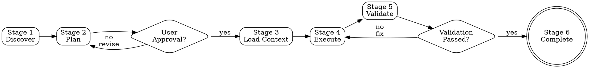

<EXTREMELY-IMPORTANT>
IF you are starting ANY development task, you MUST use this workflow.

This is not negotiable. This is not optional. "Simple" tasks are where skipping stages causes the most wasted work.

EVERY task follows all 6 stages. NO EXCEPTIONS.
</EXTREMELY-IMPORTANT>

# OpenAgents Control (OAC) Workflow

## Overview

Context-first parallel execution with 6 mandatory stages and 2 approval gates.

**Terminal state:** Stage 6 Complete (task documented and summarized)

**Core value:** **5x faster feature development through parallel multi-agent execution**

---

## Anti-Pattern: "This Is Too Simple for the Full Workflow"

Every task goes through all 6 stages. A "simple" email validation, a config change, a "quick fix" — all of them.

"Simple" tasks are where unexamined assumptions cause the most wasted work:
- No context → implement wrong pattern → code review feedback → rework (30+ min wasted)
- No approval → build wrong thing → user rejects → start over (hours wasted)
- No validation → tests fail in CI → debug → fix → re-deploy (hours wasted)

The workflow is fast for simple tasks (5-10 minutes). Skipping it costs 30+ minutes in rework.

---

## The Iron Law

```
CONTEXT FIRST, CODE SECOND

Stage 1 → 2 → APPROVAL GATE → 3 → 4 → 5 → VALIDATION GATE → 6
            ↑                              ↑
         APPROVAL                    VALIDATION
          GATE                          GATE
```

NO skipping stages. NO coding before approval. NO completion before validation.

---

## Workflow Diagram



---

## Checklist

Create TodoWrite items for each stage:

1. **Stage 1: Discover** — Invoke `/context-discovery`, get context file list
2. **Stage 2: Plan** — Create plan (simple: approach, complex: use `/task-breakdown`), present to user
3. **APPROVAL GATE** — Wait for user confirmation
4. **Stage 3: LoadContext** — Read ALL discovered context files
5. **Stage 4: Execute** — Implement (simple: direct, complex: parallel via BatchExecutor)
6. **Stage 5: Validate** — Run tests, verify criteria, STOP if failed
7. **VALIDATION GATE** — All tests pass, all criteria met
8. **Stage 6: Complete** — Update docs, summarize, cleanup

---

## The Stages

### Stage 1: Discover

**Goal:** Understand task + find context files

**Actions:**
1. Analyze request: What to build, scope, risks
2. Invoke `/context-discovery [task description]`
3. Capture returned context file list (Critical → High → Medium priority)

**Output:** Context file list

---

### Stage 2: Plan

**Goal:** Create execution plan + get approval

**Actions:**

**Simple tasks (1-3 files, <30 min):**
- Direct implementation approach
- Files to create/modify
- Key technical decisions

**Complex tasks (4+ files, >30 min):**
- High-level breakdown into phases
- Dependencies between components
- Use `/task-breakdown` for detailed subtasks
- **Parallel execution**: TaskManager identifies which subtasks can run in parallel

**Present plan:**
- Summary of approach
- Files to be created/modified
- Context files to be loaded
- Estimated complexity
- **Parallel batches** (if complex task)

<HARD-GATE>
REQUEST APPROVAL. Wait for user confirmation.

DO NOT proceed to Stage 3 without explicit user approval.

This applies to EVERY task, regardless of:
- Perceived simplicity
- "Obvious" requirements
- Time pressure
- Previous similar approvals

If you think "this is too simple to need approval", STOP. You are rationalizing.
</HARD-GATE>

**Output:** Approved plan

---

### Stage 3: LoadContext

**Goal:** Pre-load ALL discovered context files for parallel execution

**Actions:**
1. Read EVERY context file from Stage 1:
   - Use Read tool for each file
   - Load in priority order (Critical → High → Medium)
   - DON'T skip any files
2. Internalize context:
   - Coding standards
   - Security patterns
   - Naming conventions
   - Architecture constraints
3. If external libraries involved, invoke `/external-scout [library] [topic]`

**Why this matters for parallel execution:**

Pre-loading prevents race conditions when multiple agents execute in parallel:

```
WITHOUT pre-loading (race condition):
CoderAgent 1 (10:00:00) → calls ContextScout → gets standards v1
CoderAgent 2 (10:00:05) → calls ContextScout → gets standards v2
Result: Inconsistent implementations ❌

WITH pre-loading (consistent):
Stage 3 (10:00:00) → Load standards once → Store in session
CoderAgent 1 (10:01:00) → Uses pre-loaded standards
CoderAgent 2 (10:01:00) → Uses same pre-loaded standards
Result: Consistent implementations ✓
```

**Output:** All context loaded and ready for parallel execution

---

### Stage 4: Execute

**Goal:** Implement following loaded context

**Simple tasks (direct execution):**
1. Implement directly
2. Follow loaded standards
3. Apply security patterns
4. Create tests if required
5. Self-review before completion

**Complex tasks (parallel execution via BatchExecutor):**
1. Invoke `/task-breakdown` → TaskManager creates subtasks with `parallel: true` flags
2. BatchExecutor groups parallelizable subtasks into batches
3. Execute batches in parallel:
   ```
   Batch 1: [Subtask 01, Subtask 02, Subtask 03] ──┐
                                                     ├─ All run simultaneously
   Batch 2: [Subtask 04, Subtask 05] ───────────────┘
   ```
4. Each parallel agent uses pre-loaded context from Stage 3
5. Track progress through subtask completion

**Time savings example:**
- Sequential: 5 subtasks × 30 min = 150 minutes
- Parallel: 5 subtasks in 2 batches = 60 minutes (2.5x faster)

**Output:** Implementation complete

---

### Stage 5: Validate

**Goal:** Verify implementation works

**Actions:**
1. Run tests (if they exist)
2. Validate against acceptance criteria
3. **For parallel execution**: Verify consistency across parallel implementations

<HARD-GATE>
STOP if validation fails:
- Tests fail → fix issues before proceeding
- Criteria unmet → complete implementation
- Standards violated → refactor to comply
- **Parallel conflicts** → resolve inconsistencies

DO NOT proceed to Stage 6 until validation passes.
</HARD-GATE>

**Output:** Validated, working implementation

---

### Stage 6: Complete

**Goal:** Finalize with docs and cleanup

**Actions:**
1. Update documentation (if needed)
2. Summarize what was done:
   - Files created/modified
   - Key technical decisions
   - **Parallel execution metrics** (if applicable): time saved, batches executed
   - Follow-up tasks needed
3. Cleanup (if applicable):
   - Remove temporary files
   - Archive session files
4. Present completion summary to user

**Output:** Task complete, documented, summarized

---

## Red Flags - STOP and Follow Workflow

If you catch yourself thinking:
- "Quick fix, skip context discovery"
- "Obvious what they want, skip approval"
- "It's working, skip validation"
- "Too simple for full workflow"
- "Context will slow me down"
- "I'll load context as needed"
- "Validation is just a formality"
- "Parallel execution is overkill"

**All of these mean: STOP. Follow the workflow from Stage 1.**

You are rationalizing. The workflow is non-negotiable.

---

## Common Rationalizations

| Excuse | Reality |
|--------|---------|
| "Too simple for full workflow" | Simple tasks are where skipping stages costs most (30+ min rework) |
| "I know what they want" | Assumptions cause misalignment. Get approval. (Saves hours) |
| "Context will slow me down" | Context load = 2 min. Rework = 30+ min. |
| "Validation is formality" | Skipping validation = bugs in production = emergency fixes |
| "I'll load context as needed" | Causes race conditions in parallel execution |
| "Parallel is overkill" | 5x speedup for complex features is not overkill |

---

## Key Principles

### Flat Delegation Hierarchy

**Rule**: Only the main agent can invoke subagents. Subagents never call other subagents.

**Correct pattern:**
```
Main Agent → /context-discovery → ContextScout
Main Agent → /task-breakdown → TaskManager
Main Agent → /code-execution → CoderAgent (multiple in parallel)
```

**Incorrect pattern (NOT supported):**
```
Main Agent → TaskManager → CoderAgent → ContextScout ❌
```

### Context Pre-Loading for Parallel Execution

**Why**: Prevents race conditions when multiple agents execute simultaneously

**How**: Stage 3 loads ALL context once, stored in session file, shared across all parallel agents

### Approval Gates

**Critical checkpoints:**
- **Stage 2 → 3**: User must approve plan
- **Stage 5 → 6**: Validation must pass

**Never skip approval** - prevents wasted work and ensures alignment

### Parallel Execution (Complex Tasks)

**When**: Complex tasks (4+ files, >30 min) with parallelizable subtasks

**How**: 
1. TaskManager identifies parallel subtasks (`parallel: true`)
2. BatchExecutor groups into batches
3. Multiple CoderAgents execute simultaneously
4. All use same pre-loaded context (Stage 3)

**Benefit**: 5x faster for complex features

---

## Skill Invocations

| Skill | Stage | Purpose |
|-------|-------|---------|
| `/context-discovery` | 1 | Find context files |
| `/external-scout` | 3 | Fetch external library docs |
| `/task-breakdown` | 2 (complex) | Create detailed subtasks with parallel flags |
| `/code-execution` | 4 | Implement code subtasks (multiple in parallel) |
| `/test-generation` | 4 | Create test subtasks |
| `/code-review` | 4 | Review code subtasks |

---

## Examples

### Simple Task: Add email validation

**Stage 1:** Discover validation patterns, security standards  
**Stage 2:** Plan "Add regex to endpoint", get approval  
**Stage 3:** Load patterns, standards  
**Stage 4:** Implement validation + tests, self-review  
**Stage 5:** Run tests, verify criteria  
**Stage 6:** Update API docs, summarize  

**Time:** ~10 minutes

---

### Complex Task: Build authentication system

**Stage 1:** Discover auth patterns, security standards, architecture guides  
**Stage 2:** Plan "Multi-phase: JWT service, middleware, endpoints, tests", get approval  
**Stage 3:** Load all discovered files (shared across parallel agents)  
**Stage 4:** Parallel execution via BatchExecutor:
```
Batch 1 (parallel):
├─ CoderAgent 1 → JWT service
├─ CoderAgent 2 → Auth middleware  
└─ CoderAgent 3 → Login endpoint

Batch 2 (parallel):
├─ CoderAgent 4 → Password reset
└─ TestEngineer → Test suite
```
**Stage 5:** Run full test suite, verify all criteria, check consistency  
**Stage 6:** Update docs, summarize, show time saved (5x faster)  

**Time:** ~60 minutes (vs 300 minutes sequential = 5x faster)

---

## Session Management (Complex Tasks)

**Location**: `.tmp/sessions/{session-id}/`

**Files**:
- `context.md` - Shared context for all parallel agents
- `subtasks/` - Individual subtask definitions
- `.manifest.json` - Parallel execution state tracking

**Cleanup**: After Stage 6, ask user if session files should be deleted

---

## OAC vs Sequential Workflows

| Aspect | Sequential (Superpowers) | Parallel (OAC) |
|--------|--------------------------|----------------|
| **Model** | 1 agent, sequential | Multiple agents, parallel |
| **Best for** | Simple tasks (< 1 hour) | Complex features (> 4 hours) |
| **Speed** | Fast for simple | **5x faster for complex** |
| **Use case** | "Fix typo" | "Build auth system" |

**When to use OAC**: Multi-component features, complex refactors, large features (4+ hours)

---

## Related Skills

- `context-discovery` - Stage 1 context discovery
- `external-scout` - Stage 3 external library documentation
- `task-breakdown` - Stage 4 complex task delegation with parallel flags
- `code-execution` - Stage 4 code implementation (parallel capable)
- `test-generation` - Stage 4 test creation
- `code-review` - Stage 4 code review

---

## Success Criteria

✅ Every task follows all 6 stages in order  
✅ Context discovered before execution  
✅ User approval obtained before implementation  
✅ All context pre-loaded (prevents race conditions in parallel execution)  
✅ Validation passes before completion  
✅ Documentation updated and task summarized  
✅ **Parallel execution used for complex tasks (5x speedup)**  
